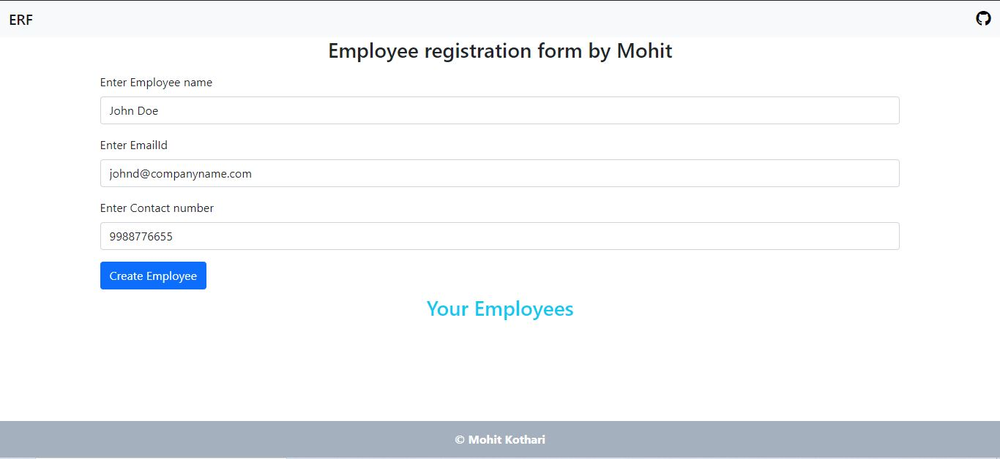

# AngularEmployeeManagementApp

This project was generated with [Angular CLI](https://github.com/angular/angular-cli) version 12.0.0.

## App is live at
https://angularemployeemanagement.web.app/

## Development server

Run `ng serve` for a dev server. Navigate to `http://localhost:4200/`. The app will automatically reload if you change any of the source files.
#### Note: Just replace your src folder with this src folder if you are also using angular-cli version 12.0.0 and you are done. 

## Code scaffolding

Run `ng generate component component-name` to generate a new component. You can also use `ng generate directive|pipe|service|class|guard|interface|enum|module`.

## Build

Run `ng build` to build the project. The build artifacts will be stored in the `dist/` directory. Use the `--prod` flag for a production build.

## Running unit tests

Run `ng test` to execute the unit tests via [Karma](https://karma-runner.github.io).

## Running end-to-end tests

Run `ng e2e` to execute the end-to-end tests via a platform of your choice.

## Further help

To get more help on the Angular CLI use `ng help` or go check out the [Angular CLI Overview and Command Reference](https://angular.io/cli) page.

## Screen Shots

#### 1. Landing Page

#### 2. Inserting the Values

After clicking on the create employee button one row will be added without refreshing the page.

#### 3. Displaying Employee Details

#### 4. Resign

#### 5. Promotion

